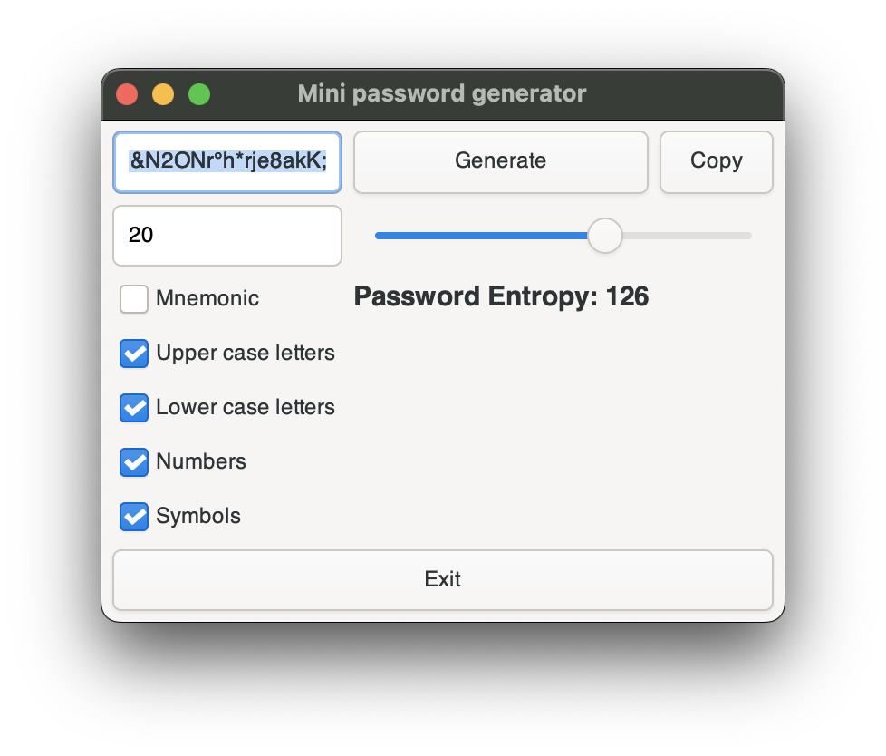

# Mini password generator
Mini password generator is a little experiment with GTK4 and Rust.



### MacOS - Install GTK4
```
brew install gtk4
```

### Linux - Install libraries
```
sudo apt-get install libglib2.0-dev libgtk-4-dev libpango1.0-dev
```

### Run application
```
cargo run
```

### Build a production version
```
cargo build --release
```